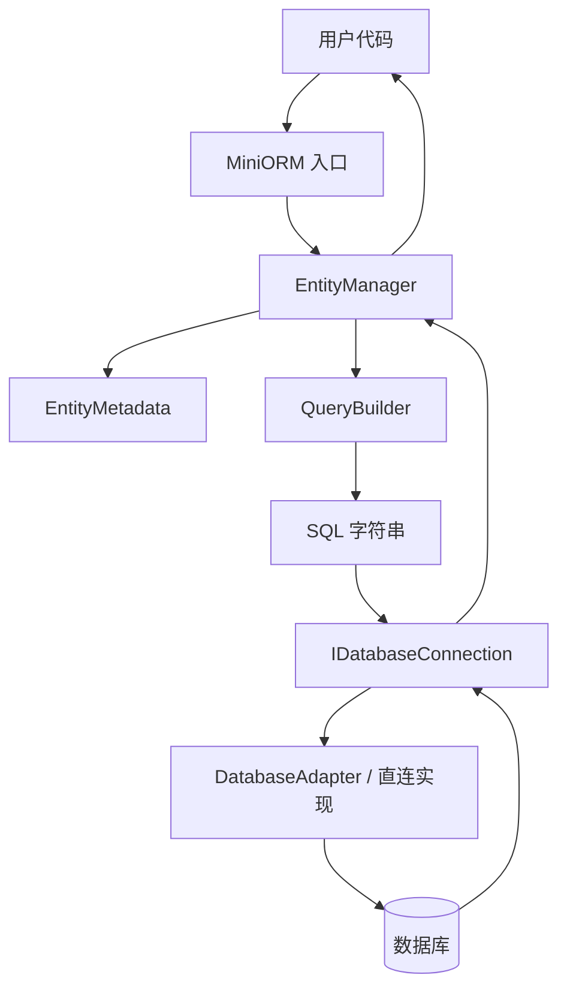
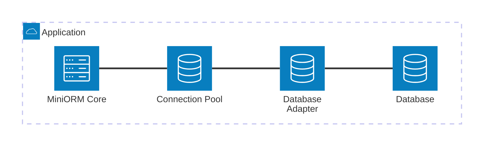

### **C++20 MiniORM 技术说明书**

## **快速开始 (Quick Start)**

构建并运行测试与示例（在项目根目录）：

```bash
mkdir -p build && cd build
cmake -S .. -B .
cmake --build . -- -j$(nproc)
ctest --output-on-failure
cp ../miniorm_mysql.conf.example ../miniorm_mysql.conf
./miniorm_example ../miniorm_mysql.conf
```

说明：示例优先读取本地配置文件 `miniorm_mysql.conf`，环境变量仍可覆盖配置文件内容。默认参数为 `127.0.0.1:3306`、用户 `cppdev`、密码 `0330`、数据库 `miniorm_demo`。

配置文件格式是简单的 `key=value`，支持这些字段：`host`、`port`、`user`、`password`、`database`、`options`。

如果你希望手动用 `g++` 编译示例，需要带上 MySQL 客户端库：

```bash
g++ -std=c++20 example.cpp -I./include -L./build -lminiorm $(mysql_config --cflags --libs) -pthread -o example
```

## **1. 项目概述**

MiniORM 是一个轻量级、现代化的 C++20 对象关系映射（ORM）框架，目标是在统一抽象下展示查询构建、实体映射、连接管理与数据库适配的完整实现路径。当前仓库已完成核心框架、查询层、实体层、连接层、适配层、测试体系和 CMake 构建接入，并已接入可用的本地 MySQL 直连适配。


**核心目标：**
1. 深入理解ORM框架的工作原理
2. 掌握C++20现代特性在数据库操作中的应用
3. 学习数据库连接池和 RAII 资源管理的实现机制
4. 实践模板元编程、概念约束和实体元数据设计

## **2. 技术栈**

- **语言**: C++20（使用 concepts、constexpr、ranges 等现代特性）
- **数据库抽象**: 当前实现以 `IDatabaseConnection` 为核心，并提供 MySQL 直连适配与内存型回退实现
- **构建系统**: CMake 3.20+
- **单元测试**: 以可执行测试程序和 `ctest` 为主
- **依赖管理**: 需要本机安装 MySQL 客户端开发包，构建时会自动通过 `mysql_config` 探测
- **开发环境**: Linux/macOS/Windows (跨平台支持)

## **3. 项目整体流程**

MiniORM 的执行路径可以理解为四层：配置与基础类型、SQL 构建、实体映射、数据库执行。

1. 用户在 `include/miniorm/miniorm.hpp` 看到的是统一入口，实际使用时先创建 `MiniORM` 对象。
2. `MiniORM` 持有 `IDatabaseConnection`，并把连接对象交给 `EntityManager<T>`。
3. `EntityManager<T>` 读取 `EntityMetadata<T>`，把实体字段映射成 SQL。
4. `QueryBuilder` 负责拼接 INSERT / UPDATE / SELECT / DELETE。
5. `DatabaseConnection` 或底层 `IDatabaseConnection` 执行 SQL，结果再通过 `EntityMetadata<T>::deserialize()` 还原成实体。

### **项目流程图**


### **架构关系图**


## **4. 目录与文件总览**

这一部分先给出“文件是干什么的”，后面再按模块解释细节。为了便于阅读，已经不再展示核心类源码，只说明它们的职责和彼此关系。

### **4.1 `include/miniorm/core/`：基础设施层**

- `include/miniorm/core/config.hpp`
    - 放项目级别宏、平台检测、编译器开关和基础类型别名。
    - 这个文件决定整个库是否启用 C++20、是否启用导出宏、以及一些通用的编译期约束。

- `include/miniorm/core/concepts.hpp`
    - 放 C++20 `concepts`，例如可转换、可映射、可数据库写入等约束。
    - 这层的作用不是做业务，而是让后面的模板接口在编译期就能筛掉不合法的类型。

- `include/miniorm/core/traits.hpp`
    - 放类型特征、类型名、SQL 类型映射等辅助模板。
    - 主要给实体映射、字符串转换和结果集读取提供统一的类型基础。

- `include/miniorm/core/utils.hpp`
    - 放字符串拼接、SQL 转义、格式化和常用工具。
    - 查询构建和错误提示很多都依赖这里的工具函数。

- `src/core/utils.cpp`
    - 放工具层的具体实现，例如日志、字符串缓存、异常生成等。
    - 可以理解为 core 工具的运行时实现部分。

### **4.2 `include/miniorm/adapter/`：数据库抽象层**

- `include/miniorm/adapter/adapter.hpp`
    - 这是数据库抽象的核心接口文件。
    - 它定义了数据库类型、配置、异常、结果行/结果集、语句接口、数据库连接接口、适配器工厂，以及面向上层的数据库操作辅助类。
    - 如果只看一个文件来理解 MiniORM 怎么“连上数据库并执行 SQL”，就看这里。

- `src/adapter/adapter.cpp`
    - 放数据库抽象层的实际实现。
    - 包括配置校验、异常信息、适配器工厂和当前可用的后端实现逻辑。

### **4.3 `include/miniorm/connection/`：连接与事务层**

- `include/miniorm/connection/database_connection.hpp`
    - 这是高层数据库连接封装。
    - 它把“连接池、直连、监控统计、事务、批量操作、连接状态”包装成一个更适合上层使用的对象。

- `include/miniorm/connection/connection_pool.hpp`
    - 提供连接池相关类型的对外别名或入口。
    - 这一层让外部调用不用直接面对底层复杂实现。

- `include/miniorm/connection/transaction.hpp`
    - 提供事务相关别名或 RAII 入口。
    - 用于把事务生命周期和对象生命周期绑定起来。

- `src/connection/database_connection.cpp`
    - 连接封装的运行时实现，包含连接状态、重连、健康检查和监控统计。

- `src/connection/connection_pool.cpp`
    - 连接池的实际 acquire / release / cleanup / shutdown 逻辑。

- `src/connection/connection_manager.cpp`
    - 管理器、作用域连接和事务 RAII 的实现。
    - 这一层更偏向“使用体验”，把连接管理变成自动释放。

- `src/connection/transaction.cpp`
    - 事务对象的具体实现。
    - 主要负责 begin / commit / rollback 的运行时流程。

### **4.4 `include/miniorm/query/`：查询构建层**

- `include/miniorm/query/condition.hpp`
    - 定义条件对象和字段表达式，用于拼接 WHERE 子句。
    - 这一层把“字段比较、AND/OR 组合、NULL 判断”等逻辑抽出来。

- `include/miniorm/query/query_builder.hpp`
    - 查询构建器的声明文件。
    - 负责把 select / insert / update / delete 这些 SQL 模式用链式 API 表达出来。

- `src/query/query_builder.cpp`
    - 查询构建器的拼接实现。
    - 这里负责把条件、排序、分页、字段和值最终拼成 SQL。

### **4.5 `include/miniorm/entity/`：实体映射层**

- `include/miniorm/entity/reflection.hpp`
    - 放实体元数据定义，例如字段标记、字段信息、实体元数据默认模板。
    - 它是实体和数据库列之间的映射中心。

- `include/miniorm/entity/entity_traits.hpp`
    - 放 `Entity<Derived>` 这类 CRTP 基类和 `EntityModel` 概念约束。
    - 作用是让实体类获得统一接口，同时让模板代码更容易约束实体类型。

- `include/miniorm/entity/entity_manager.hpp`
    - 实体管理器，负责 save / remove / find / count / exists。
    - 它把实体元数据、查询构建器和数据库连接串起来，构成 ORM 的核心业务流程。

- `include/miniorm/entity/entity_macros.hpp`
    - 实体声明辅助宏文件。
    - 作用是减少实体样板代码，尤其适合演示项目或小型实体定义。

- `src/entity/reflection.cpp`
    - 字段标记字符串化等辅助实现。

- `src/entity/entity_manager.cpp`
    - 实体管理器模板相关实现入口。
    - 这类文件通常是模板代码的编译落点。

### **4.6 `include/miniorm/miniorm.hpp`：统一入口**

- `include/miniorm/miniorm.hpp`
    - 对外主入口头文件。
    - 用户通常只需要包含它，就能拿到 core、adapter、connection、query、entity 的全部能力。
    - 这里还提供 `MiniORM` 这个顶层门面对象，把连接和事务管理收拢到一个更简单的 API 上。

### **4.7 `test/`：验证与演示层**

- `test/test_support.hpp`
    - 测试专用的 fake 结果集、语句和数据库连接。
    - 它让单元测试不依赖真实数据库也能跑通实体和查询逻辑。

- `test/test_config.cpp`
    - 验证配置结构和配置相关工具。

- `test/test_traits.cpp`
    - 验证类型特征和类型映射是否正确。

- `test/test_utils.cpp`
    - 验证字符串、格式化、转义等工具函数。

- `test/test_adapter.cpp`
    - 验证适配器抽象和连接接口。

- `test/test_concepts.cpp`
    - 验证 concepts 约束是否按预期工作。

- `test/test_query.cpp`
    - 验证查询构建器和条件表达式的 SQL 生成。

- `test/test_entity.cpp`
    - 这是最重要的 ORM 演示测试之一。
    - 它展示一个实体 `User`、元数据特化、实体管理器 CRUD，以及如何把实体和 SQL 串起来。

- `test/test_integration.cpp`
    - 综合验证多个模块能否协同工作。

## **5. 关键流程说明**

### **5.1 从实体到 SQL**

实体层的关键是 `EntityMetadata<T>`。它告诉框架三件事：表名、主键名、字段列表。`EntityManager<T>` 读取这些元数据后，会把实体对象里的字段转换成 SQL 值，再交给 `QueryBuilder` 生成 SQL。

### **5.2 从 SQL 到数据库**

`QueryBuilder` 生成 SQL 字符串后，`IDatabaseConnection` 负责真正执行。这里可以是直连数据库，也可以是连接池里的连接，或者测试中的 fake 连接。

### **5.3 从结果集回到实体**

查询返回后，`IResultRow` 提供按列名或列序号读取数据的能力，`EntityMetadata<T>::deserialize()` 负责把这一行重新组装成实体对象。

### **5.4 事务与资源管理**

`MiniORM::transaction()` 和 `ScopedTransaction` 这类对象的作用，是把 begin / commit / rollback 变成自动流程，减少手工管理错误。连接池和 RAII 也是同一思路：让资源释放尽量自动化。

## **6. 代码文件的实际作用说明**

- `include/miniorm/core/*`：负责“类型规则”和“通用能力”，本身不直接访问数据库。
- `include/miniorm/adapter/*`：负责“数据库怎么连、怎么执行、怎么拿结果”。
- `include/miniorm/connection/*`：负责“连接的生命周期、池化、事务、监控”。
- `include/miniorm/query/*`：负责“SQL 怎么拼出来”。
- `include/miniorm/entity/*`：负责“实体和表怎么对应”。
- `src/*`：负责这些声明背后的运行时实现。
- `test/*`：负责验证每个模块在真实场景下能否连起来。

## **7. 配置与使用方式**

MiniORM 当前默认以本地 MySQL 作为主要演示环境，但底层仍然保留数据库抽象接口。配置文件 `miniorm_mysql.conf.example` 只是本人示例入口，可自行更改


